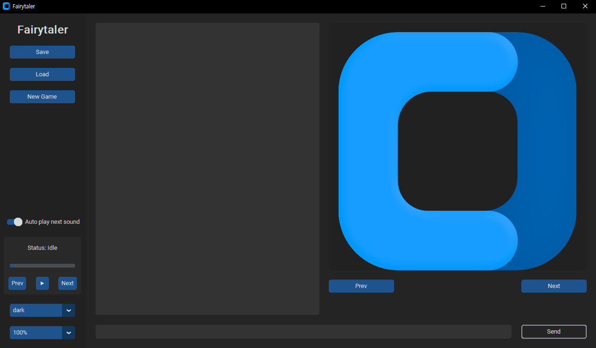
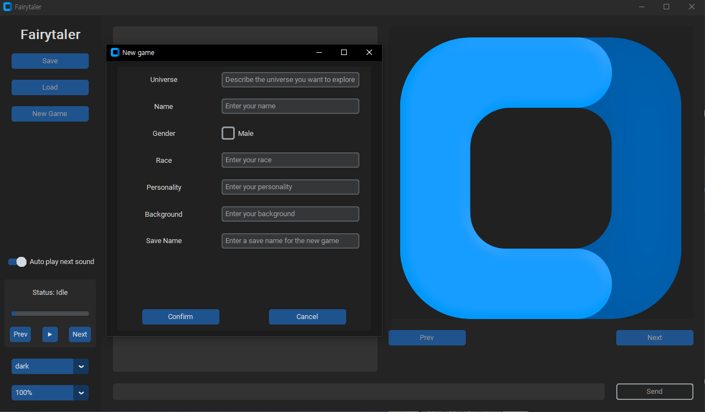
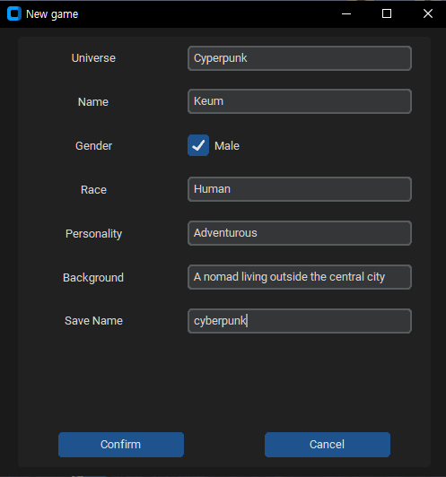
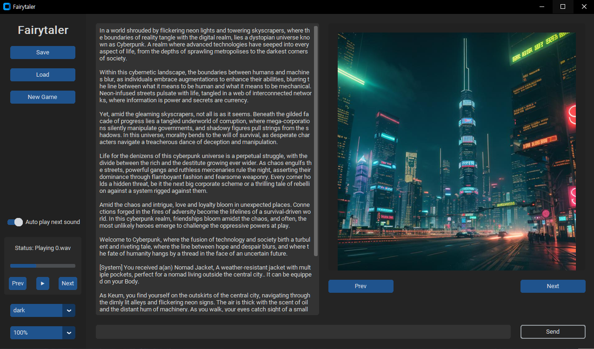
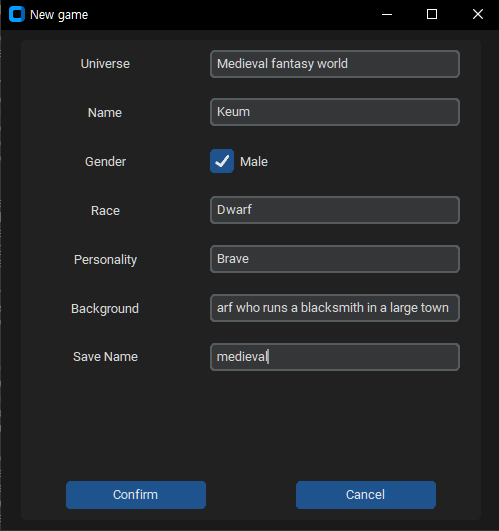
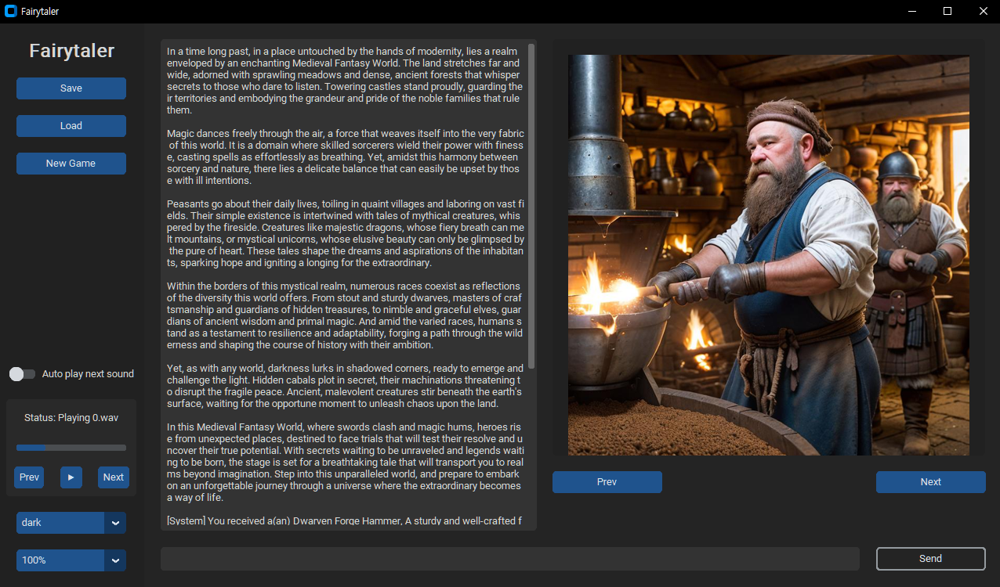

# Fairytaler
Interactive story generator based on generative models.     
The goal of this project is to make an interactive, infinitely replayable text-based game.

## Requirements

### Packages
To play this game, you need to install all the necessary libraries by executing the following command.

```
$pip install -r requirements.txt
```
Note that ```requirements.txt``` is in the repository.


Additionally, You need to install a CUDA-enabled Torch library form [here](https://pytorch.org/get-started/locally/).

### Environment Variable
To play this game, you'll need an OpenAI API key.    
The game utilizes an environment variable named ```OPENAI_API_KEY``` as the key for authentication.      
Refer to [this page](https://platform.openai.com/docs/api-reference/authentication) for more details.

### System

You need enough VRAM and DRAM capacity to load models and perform inferences with them.

## How to play

1. Run ```main.py``` to start the game.   
2. Click the ```New Game``` button and provide necessary information for story generation.
3. Click the ```Confirm``` button
4. Wait for texts, images, and audios to be generated.
5. Enter your response in the entry below and click the ```Send``` button.
6. New texts, images, and audios will be generated. Return to step 5.

## Images

### Main

### New Game

### EX1 : Cyberpunk


### EX1 : Medieval Fantasy World


